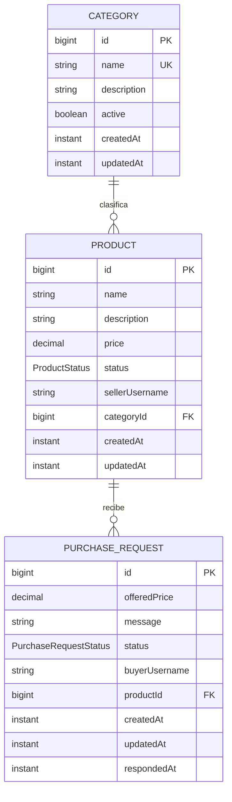

# Modelo de dominio - PUCE Market

No existen tablas de usuarios, roles, perfiles, conversaciones, mensajes, notificaciones ni teléfonos. La identidad del comprador y vendedor se conserva como el `username` procedente del JWT, que será validado en la capa de seguridad.
